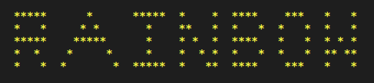

# Rainbow      

Rainbow is the best library to create colorful User Interfaces for Linux Terminals.

* **Simple and Easy to use:** Rainbow is very simple and easy to use. You don't have to learn anything for using this library except java and terminal.

* **Declare once, use anytime:** You have to declare a rainbow instance only once and then you can use any where in your project.

* **No need to learn hexadecimal color codes:** For using rainbow you don't have to learn or find the color codes which you need for your project.

* **Minified Library:** Rainbow has very less size as compared to other java libraries. Rainbow core is very small that's why it has  only.

## Projects using Rainbow

* [RAINBOW core](https://github.com/GauravWalia19/RAINBOW)
* [TETRIS](https://github.com/GauravWalia19/TETRIS)
* [BATTLESHIPS-GAME](https://github.com/GauravWalia19/Java-Projects/tree/master/BATTLESHIPS-GAME)
* [MAZE RUNNER](https://github.com/GauravWalia19/Java-Projects/tree/master/MAZE-RUNNER)
and many more

## Supported OS

* Linux (all distributions)
* Mac

## Supported Languages


## Installation

Rainbow has three methods from which you can use in your project.

* [For Developers]()
* [For jar lovers]()
* [By using package registory(in progress)]()

For detailed installation guidelines according to your IDE read [installation instructions here]().

## Examples

Here is the example which shows usage of rainbow library of java. For [more read more tutorials here](). For running this project read our [documentation](#documentation) for getting started.

```java
import org.techous.rainbow.*;

public class Main{
    public static void main(String[] args) {
        Rainbow rain = new Rainbow();
        System.out.println();
        System.out.println(rain.getFormatColorString("bold","y"," *****      *      *****  *    *  ****    ***   *   * ", true));
        System.out.println(rain.getFormatColorString("bold","y"," *   *     * *       *    **   *  *   *  *   *  *   * ", true));
        System.out.println(rain.getFormatColorString("bold","y"," *****    *****      *    * *  *  ****   *   *  * * * ", true));
        System.out.println(rain.getFormatColorString("bold","y"," *  *    *     *     *    *  * *  *   *  *   *  ** ** ", true));
        System.out.println(rain.getFormatColorString("bold","y"," *   *  *       *  *****  *   **  ****    ***   *   * ", true));
        System.out.println();
    }
}
```

Here is the output of the program when you run the sample code.



## Documentation

For documentation take look at our [ here]().

## Contributing to rainbow 

For contributing read our contribution guidelines [here](CONTRIBUTING.md).

## LICENSE

rainbow uses [](LICENSE)

Copyright :copyright: 2020 TechOUs
